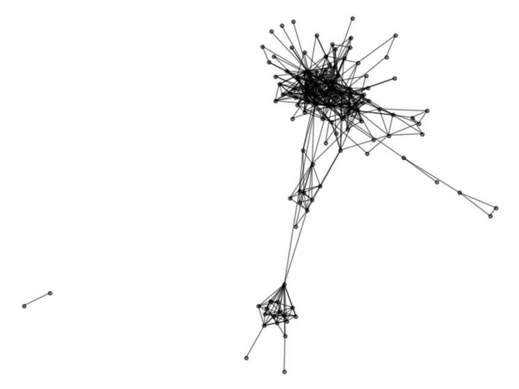
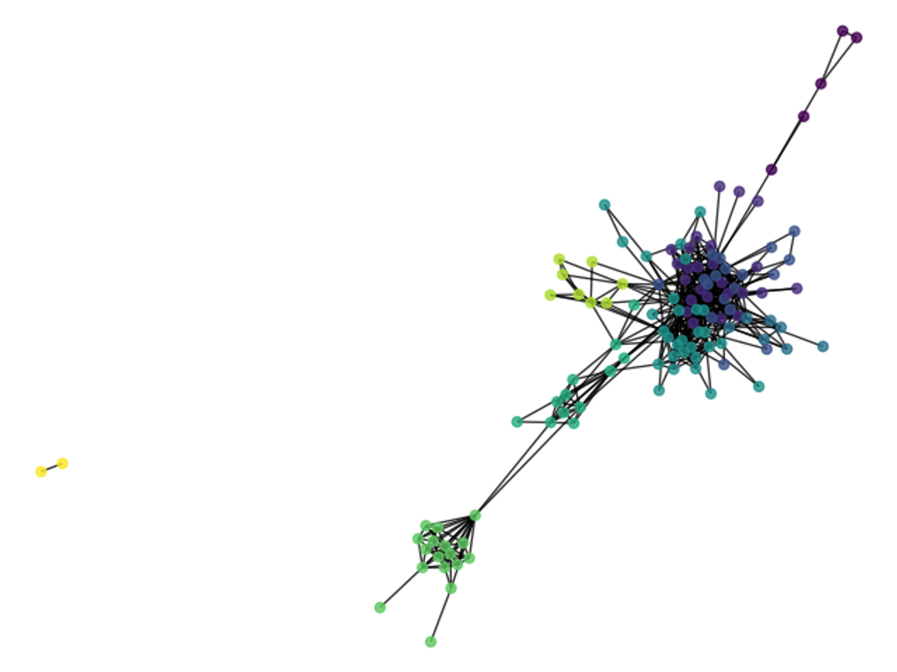

# Работа с API ВКонтакте

### Регистрация приложения и получение токена доступа

Чтобы начать работать с API от вас требуется зарегистрировать новое приложение. Для этого зайдите на форму создания
нового Standalone приложения https://vk.com/editapp?act=create и следуйте инструкциям. Вашему приложению будет назначен
идентификатор, который потребуется для выполнения работы.

Запросы к API ВКонтакте имеют следующий формат ([из документации](https://vk.com/dev/api_requests)):

где:

- `METHOD_NAME` - это название метода API, к которому Вы хотите обратиться (например, получить список друзей).
- `PARAMETERS` - входные параметры соответствующего метода API, последовательность пар name=value, объединенных
  амперсандом & (например, количество друзей).
- `ACCESSS_TOKEN` - ключ доступа.
- `V` - используемая версия API.

Например, чтобы получить список друзей, с указанием их пола, нужно выполнить следующий запрос:

```
https://api.vk.com/method/friends.get?fields=sex&access_token=0394a2ede332c9a13eb82e9b24631604c31df978b4e2f0fbd2c549944f9d79a5bc866455623bd560732ab&v=5.126
```

Так как токен доступа (`access_token`) ненастоящий, то этот запрос работать не будет. Чтобы получить токен доступа вы
можете воспользоваться написанным для вас скриптом `access_token.py` следующим образом:

```
$ python access_token.py YOUR_CLIENT_ID -s friends
```

где вместо `YOUR_CLIENT_ID` необходимо подставить идентификатор вашего приложения.

После выполнения команды откроется новая вкладка браузера, из адресной строки которого вам необходимо скопировать токен
доступа.


### Прогнозирования возраста

Список пользователей можно получить с помощью метода `friends.get`. Ниже приведен пример обращения к этому методу для
получения списка всех друзей указанного пользователя:

```python
domain = VK_CONFIG["domain"]
access_token = VK_CONFIG["acceess_token"]
v = VK_CONFIG["version"]
user_id =  # PUT USER ID HERE
fields = 'sex'

query = f"{domain}/friends.get?access_token={access_token}&user_id={user_id}&fields={fields}&v={v}"
response = requests.get(query)
```

Функция `requests.get` выполняет GET запрос и возвращает объект `Response`, который представляет собой ответ сервера на
посланный нами запрос.

Объект `Response` имеет множество атрибутов:

```python
>>> response.<tab>
response.apparent_encoding      response.history                response.raise_for_status
response.close                  response.is_permanent_redirect  response.raw
response.connection             response.is_redirect            response.reason
response.content                response.iter_content           response.request
response.cookies                response.iter_lines             response.status_code
response.elapsed                response.json                   response.text
response.encoding               response.links                  response.url
response.headers                response.ok
```

Нас интересует только метод `response.json`, который возвращает `JSON` объект:

```python
>>> response.json()
{'response': {'count': 136,
              'items': [{'first_name': 'Drake',
                         'id': 1234567,
                         'last_name': 'Wayne',
                         'online': 0,
                         'sex': 1},
                        {'first_name': 'Gracie'
                         'id': 7654321,
                         'last_name': 'Habbard',
                         'online': 0,
                         'sex': 0},
                         ...
>>> response.json()['response']['count']
136
>>> response.json()['response']['items'][0]['first_name']
'Drake'
```

Поле `count` содержит число записей, а `items` список словарей с информацией по каждому пользователю.

Выполняя запросы мы не можем быть уверены, что не возникнет ошибок. Возможны различные ситуации, например:

- есть неполадки в сети;
- удаленный сервер по какой-то причине не может обработать запрос;y
- мы слишком долго ждем ответ от сервера.

В таких случаях необходимо попробовать повторить запрос. При этом повторные запросы желательно посылать не через
константные промежутки времени, а по алгоритму экспоненциальной задержки.

Описание алгоритма с примерами можно найти в статье [Exponential Backoff](https://habrahabr.ru/post/227225/) или как «не
завалить сервер». Почитать про обработку исключений при работе с библиотекой `requests`
можно [тут](https://khashtamov.com/ru/python-requests/).

Для этого реализован класс `Session`, который позволяет выполнять `GET` и `POST`-запросы к указанному адресу, а при
необходимости повторять запрос указанное число раз по алгоритму экспоненциальной задержки.

Описание лучших практик при использовании модуля `requests` можно
найти [тут](https://findwork.dev/blog/advanced-usage-python-requests-timeouts-retries-hooks/)

Примеры использования:

```python
>>> s = Session(base_url="https://httpbin.org", timeout=3)
>>> s.get("get")
<Response [200]>
>>> s.get("delay/2")
<Response [200]>
>>> s.get("delay/2", timeout=1)
ReadTimeoutError: HTTPSConnectionPool(host='httpbin.org', port=443): Read timed out. (read timeout=1)
>>> s.get("status/500")
RetryError: HTTPSConnectionPool(host='httpbin.org', port=443): Max retries exceeded with url: /status/500 (Caused by ResponseError('too many 500 error responses'))
```

### Построение социального графа

Одной из задач при анализе социальных сетей является построение и
анализ [социального графа](https://ru.wikipedia.org/wiki/%D0%A1%D0%BE%D1%86%D0%B8%D0%B0%D0%BB%D1%8C%D0%BD%D1%8B%D0%B9_%D0%B3%D1%80%D0%B0%D1%84),
то есть графа, «узлы
которого представлены социальными объектами, такими как пользовательские профили с различными атрибутами, сообщества,
медиаконтента и так далее, а рёбра — социальными связями между ними». Мы построим одну из разновидностей социального
графа - эгоцентричный граф или граф друзей. Обычно под эгоцентричным графом понимают граф, в котором устанавливаются
связи между друзьями некоторого пользователя. Для этого требуется делать запросы к методу `friends.getMutual`,
который позволяет получить список общих друзей между парой пользователей.

Одним из ограничений метода `friends.getMutual` является ограничение на максимальное количество идентификаторов
пользователей, с которыми необходимо искать общих друзей, то есть `target_uids` должен содержать не более 100
идентификаторов. Нужно учитывать, что к методам `API ВК` с ключом доступа пользователя или сервисным ключом доступа
можно обращаться не чаще 3-х раз в секунду:

```python
>>> from tqdm import tqdm
>>> friends_response = get_friends(user_id=817934, fields=["nickname"])
>>> active_users = [user["id"] for user in friends_response.items if not user.get("deactivated")]
>>> len(active_users)
136
>>> mutual_friends = get_mutual(source_id=817934, target_uids=active_users, progress=tqdm)
100%|██████████████████████████████████████████████████| 2/2 [00:00<00:00, 13.37it/s]
```

В приведенном примере мы оставляем только активных пользователей, фильтруя их по полю `deactivated`, чтобы не получить
ошибку `User was deleted or banned`, а затем получаем список общих пользователей за два запроса.

Функция ego_network() позволяет построить эгоцентричный граф друзей для указанного пользователя (по умолчанию
текущего) и заданного множества его друзей (по умолчанию всех друзей)

```python
>> > net = ego_network(user_id=817934)
>> > net[:5]
[(4181, 4206848), (4181, 403284), (4734, 262371), (4734, 251463), (4734, 740914)]
>> > plot_ego_network(net)
```




Очевидно, что в полученном графе есть сообщества (в качестве примеров сообществ можно привести: школьных и 
университетских друзей, коллег по работе, членов семьи и т.д.). Поиск сообществ на графе (community detection) является 
хорошо изученной задачей, а ряд наиболее известных алгоритмов реализован в библиотеке `community`

```python
>>> net = ego_network(user_id=817934)
>>> plot_communities(net)
```




Можно воспользоваться готовыми функциями для просмотра информации о пользователях в сообществах:

```python
>>> communities = get_communities(net)
>>> describe_communities(communities, friends_response.items, fields=["first_name", "last_name"])
   cluster  first_name    last_name
0        0       Антон      Антонов
1        0     Алексей       Кнорре
2        0    Владимир  Волохонский
...
```